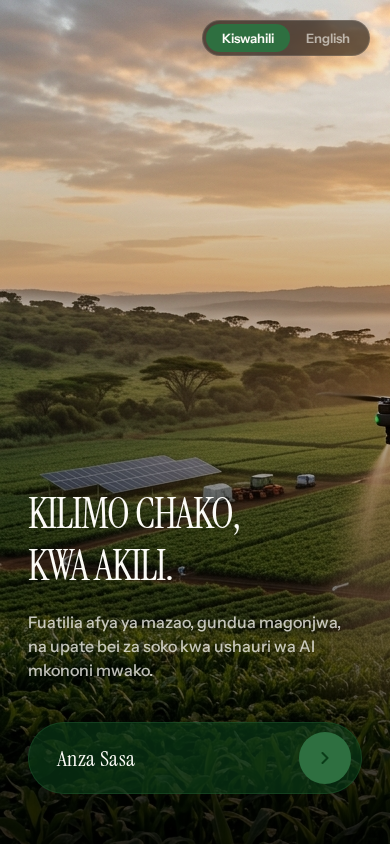

# Kilimo AI

**An AI-assisted farming companion for East African smallholder farmers — field tracking, market prices, expert consultations, and a voice-driven AI assistant, in one mobile app.**


## What this is

Kilimo AI is a React Native (Expo) mobile app aimed at helping smallholder farmers manage their operations and get expert guidance without needing to leave their fields. The app currently includes field management, a marketplace view, a calendar for farming activities, contract tracking, a consultations flow for connecting with agronomists, an AgroID feature, and an AI training hub with a voice-driven assistant.



## Status: In active development

This is a working prototype with a substantial set of screens built out, but it has not yet been through a production security/data review or field-tested with real farmers. Treat features as functional demos rather than a finished product.

### Roadmap
- Backend/data layer validation (confirm what's mocked vs. live)
- Field testing with real farmer cohorts
- Offline-first support for low-connectivity areas

## Quickstart

```bash
npm i
npm run dev        # or: npm run android / npm run ios
```

EAS build scripts are also available (`npm run eas:build:preview`, etc.) for device builds.

## Folder overview

- `app/` — Expo Router screens (tabs: fields, market, AI hub, profile, analytics, contracts, consultations, calendar)
- `components/` — shared UI components

## Contributing

See the [org-wide CONTRIBUTING.md](https://github.com/creova-gif/.github/blob/main/CONTRIBUTING.md) for guidelines, including our AI-assisted contribution policy.

## License

Proprietary — © CREOVA. All rights reserved.
