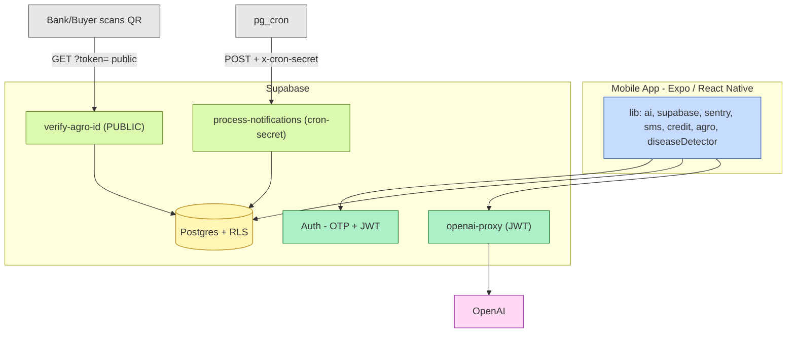
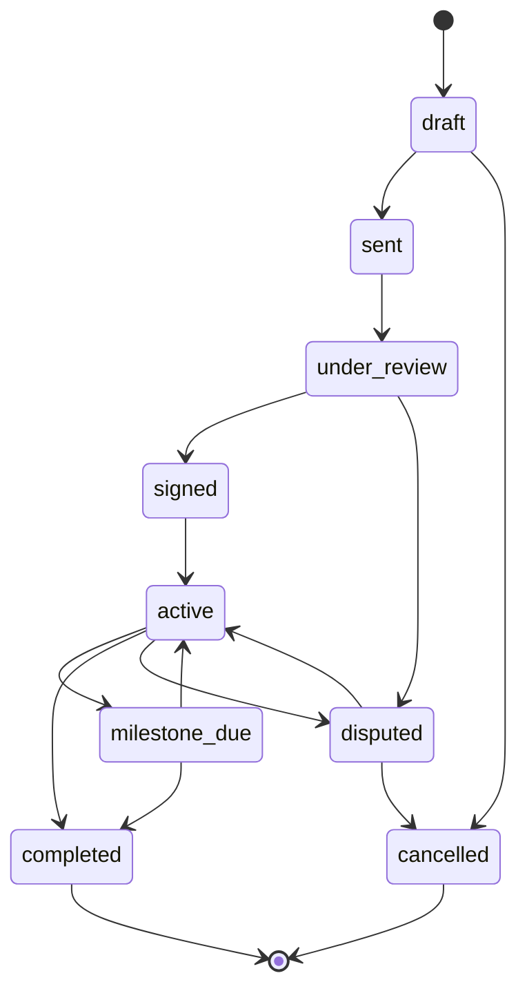
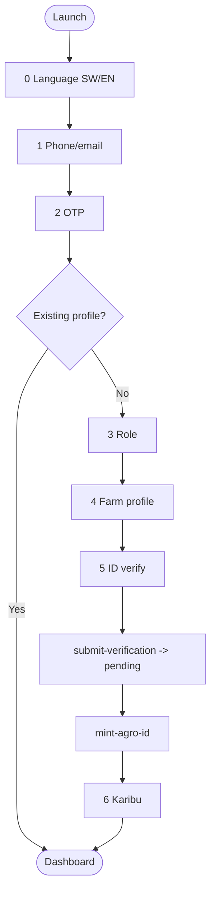

# Kilimo AI — Diagram sources (Mermaid)

Rendered copies live on the Miro board: https://miro.com/app/board/uXjVHz3Qfg4=/
These Mermaid sources are the version-controlled originals (GitHub renders them).

## 1 · System Architecture

> Full node set is on the Miro board (diagram 1). This is the condensed source.

## 6 · Contract lifecycle (state machine)

## 7 · Onboarding flow

_The remaining diagrams (Data Model ER, Auth sequence, Agro-ID verify, Crop scan, Account deletion, Client class diagram, Notifications cron, Offline sync) are on the Miro board with full detail; regenerate here from the board if a local copy is needed._
